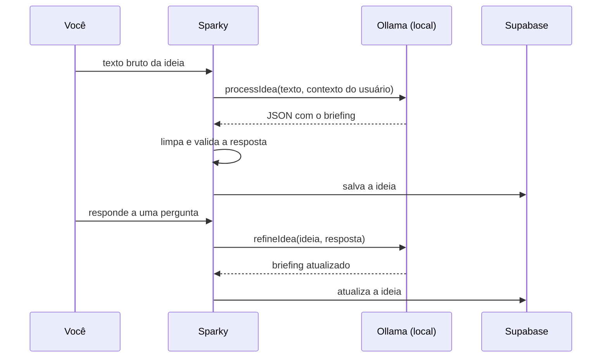

# ✦ Sparky Notes

App desktop para capturar ideias no momento em que elas aparecem e transformá-las em briefings organizados, com um modelo de linguagem rodando na sua própria máquina.

<div align="center">


&color=db1e2f&style=for-the-badge)


</div>

<!-- Adicionar aqui 2 ou 3 capturas de tela: home com a captura, detalhe da ideia com o painel de refino e biblioteca. -->

## Sobre

Ideia boa costuma aparecer na hora errada, e anotar às pressas gera uma pilha de frases soltas que ninguém revisita. O Sparky resolve as duas pontas: abre com um atalho de teclado em qualquer lugar do sistema, aceita o texto do jeito que ele sair e devolve uma ideia com título, resumo, tags, sugestão de tecnologias e perguntas para você pensar melhor sobre ela.

O processamento acontece em um LLM local, via Ollama. O texto das suas ideias não é enviado para nenhuma API de IA externa, e o app continua funcionando sem o modelo.

O foco são ideias de projeto, mas o app aceita qualquer tipo de ideia: livros, estudos, design ou anotações gerais.

## Funcionalidades

- **Captura rápida:** `Ctrl + Shift + S` (ou `Cmd + Shift + S`) abre a janela de qualquer lugar do sistema. A entrada funciona como um chat.
- **Processamento com IA:** o texto bruto vira um briefing estruturado.
- **Refino em diálogo:** no painel lateral de cada ideia, você responde às perguntas do modelo e o briefing é atualizado a cada resposta, com histórico da conversa.
- **Biblioteca:** busca, filtro por categoria (projetos, livros, design, estudo e geral) e por status, com visualização em cards ou em lista.
- **Ciclo de vida da ideia:** status de ideia, refinando, pronta, em desenvolvimento, pausada, concluída e arquivada.
- **Histórico:** linha do tempo das ideias criadas e refinadas, agrupada por dia.
- **Perfil:** foto, nome, papel de parede da biblioteca e exportação de todas as ideias em JSON ou Markdown.
- **Conta:** login com e-mail e senha ou com Google.

## Como a IA funciona

Toda a integração está em `src/lib/services/ollama.js`. O app usa o modelo em dois momentos.

### 1. Captura

Quando você envia uma ideia, o app chama `processIdea()` com o texto bruto e um prompt de sistema que define a assistente e o formato da resposta. O modelo precisa devolver apenas este JSON:

```json
{
  "title": "título curto, até 5 palavras",
  "summary": "resumo em 2 ou 3 frases",
  "tags": ["até 5 tags curtas"],
  "suggestedStack": ["até 5 tecnologias, uma por item"],
  "questions": ["2 ou 3 perguntas para refinar a ideia"]
}
```

O prompt também recebe o contexto do usuário (nome, bio e área de atuação do perfil), para que as sugestões de tecnologia façam sentido para quem está usando.

### 2. Refino

No painel de refino, cada resposta sua chama `refineIdea()`. O modelo recebe o texto original, o briefing atual, as perguntas já feitas e a nova informação, e devolve o briefing atualizado com perguntas novas. A instrução é manter o que já estava bom e incorporar o que mudou, em vez de reescrever tudo.



### Lidando com o comportamento real do modelo

Um modelo de 8B parâmetros nem sempre segue o formato pedido. O código trata isso em três camadas:

- **Limpeza:** remove blocos de código Markdown (` ```json `) que o modelo às vezes coloca em volta do JSON.
- **Fallback:** se o JSON não puder ser lido, a ideia é salva mesmo assim, com título padrão e o início da resposta como resumo. Nada do que você escreveu se perde.
- **Sanitização da stack:** o modelo tende a juntar tecnologias em um item só, como "React ou Vue" ou "Backend: Node.js, Express". A função `sanitizeStack()` separa esses itens, remove rótulos e elimina duplicatas.

### Sem o modelo

Antes de cada chamada, o app verifica se o Ollama está respondendo. Se não estiver, a ideia é salva só com o texto bruto, o indicador da barra superior mostra o modelo como offline e o painel de refino avisa que é preciso ligá-lo.

## Arquitetura

| Camada | Tecnologia |
|---|---|
| Interface | Svelte 4, Vite |
| Desktop | Tauri 2, com o plugin de atalho global |
| IA | Ollama com Llama 3.1 8B, em `localhost:11434` |
| Backend | Supabase: PostgreSQL, Auth e Storage |

```
src/
├── App.svelte          # orquestra o fluxo de captura e as telas
├── lib/
│   ├── components/     # telas e componentes: captura, biblioteca, detalhe, perfil
│   ├── services/       # clientes do Ollama e do Supabase
│   └── stores/         # estado em stores do Svelte: ideias, filtros, histórico, auth
└── styles/
src-tauri/              # configuração e código do app desktop
```

O estado fica em stores do Svelte. `ideas.js` guarda a lista e deriva a busca e os filtros, `persistence.js` traduz entre o formato do app e o do banco e `historyStore.js` agrupa os eventos por dia.

### Dados

A tabela `ideas` guarda o texto bruto e o briefing gerado. Tags, stack e perguntas ficam em colunas `jsonb`. A tabela tem Row Level Security, então cada usuário só lê e altera as próprias ideias. Fotos de perfil e papéis de parede ficam em dois buckets do Storage, e cada usuário só pode enviar e apagar os próprios arquivos.

## Rodando localmente

Requisitos: Node.js 20, Yarn, [Ollama](https://ollama.com) e, para o app desktop, o [ambiente do Tauri](https://tauri.app/start/prerequisites/).

```bash
yarn
ollama pull llama3.1:8b
yarn dev            # no navegador
yarn tauri dev      # como app desktop
yarn tauri build    # gera o instalador
```

Variáveis de ambiente (`.env`):

| Variável | Uso |
|---|---|
| `VITE_SUPABASE_URL` | URL do projeto Supabase |
| `VITE_SUPABASE_ANON_KEY` | Chave pública do Supabase |

O banco é criado com `supabase-migration.sql` (tabela `ideas`) e `storage-migration.sql` (buckets e políticas).

## Limitações conhecidas

- **Tabela de histórico:** o histórico usa a tabela `idea_events`, que não está nos scripts SQL do repositório.
- **Status padrão:** o banco usa `spark` como status padrão, e o app usa `idea`. Ideias criadas fora do app aparecem com o rótulo cru.
- **Modelo fixo:** o modelo está definido no código (`llama3.1:8b`), apesar de o serviço já listar os modelos instalados.
- **Categoria manual:** o modelo não sugere a categoria. Toda ideia entra como "geral" e a categoria é trocada à mão.

## Próximos passos

- Anexos nas ideias: fotos, vídeos, arquivos e links.
- Marcação de ideias que já viraram projeto no portfólio.
- Integração com Linear e Jira para transformar uma ideia pronta em tarefas.

## Licença

© 2026 Samara Silvia Sabino. Todos os direitos reservados.

Este repositório é público apenas para consulta e avaliação como portfólio. Não é permitido copiar, modificar, distribuir ou usar o código, total ou parcialmente, sem autorização por escrito da autora. Veja os termos completos em [LICENSE](LICENSE).

## Autora

**Samara Silvia Sabino** · Desenvolvedora Frontend e UX/UI · Mestranda em Engenharia de Software no CIn/UFPE

[LinkedIn](https://www.linkedin.com/in/samara-silvia-9a2a26231) · [GitHub](https://github.com/SamaraSilvia81) · [Portfólio](https://samarasilviadev.vercel.app)
